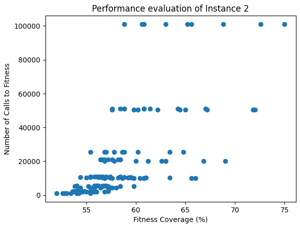

# Lab 3

## Genome & Evolutionary Strategy
The code implements an evolutionary algorithm to solve an optimization problem.  
In an effort to minimize fitness calls, we aimed to avoid unnecessary extra calls that didn't introduce significant benefits in the search for the best fitness.  
The genome represents the genetic makeup of an individual in the population. In our context, an individual has a genome composed of a sequence of binary values (0 or 1).  
The population of individuals evolves through successive generations. In each generation, individuals are evaluated based on a fitness function, and the best ones are selected as elite. The remaining individuals are chosen through random tournaments and undergo crossover and mutation, introducing genetic variations, contributing to genetic diversity, and discovering potentially better solutions.  
At the end of the evolutionary process, the algorithm returns the individual with the highest fitness from the final population as the optimal or approximate solution to the problem.

## Parent Selection
Parent Selection occurs in the following way:  
**Elite Selection:** A certain number of elite individuals are selected based on their fitness performance. Elite individuals are those with the highest fitness performances and are kept unchanged in the next generation without undergoing crossover or mutation.  
**Parent Selection for Crossover and Mutation:** To complete the new generation, two components of the elite are chosen in turn as parents and undergo crossover and mutation.  

Therefore, parent selection is a combination of elite selection, which preserves the best individuals, and random choices among elites, which introduce randomness in parent selection for genetic diversity.

## Crossover
The *crossover* function takes two parents, *parent1* and *parent2*, and generates a child by combining the information from the parents.  
The point where "crossover" occurs is randomly chosen between the second and the last element of the genome *(len(parent1) - 1)*.
Therefore, *crossover_point* represents the position (index) in the genome where the crossover between the two parents will occur.
Up to the crossover point, the genome of *parent1* is copied, and after that, the genome of *parent2* is copied.  
This helps maintain genetic diversity among individuals in the population during evolution.

## Mutation
The *mutate* function takes an individual represented as a sequence of binary values (0 or 1) and applies mutation.  
For each bit in the individual, there is a probability *(MUTATION_RATE)* that the bit will be flipped: from 0 to 1 or vice versa.

## Simulation
The simulation tests the possible configurations of parameters *(POPULATION_SIZE, MUTATION_RATE, GENERATIONS, ELITISM_PERCENTAGE)* to search for the optimal setup that yields the best solution for each problem.

Refer to the file ***output.md*** for the results printed during the execution of the algorithm.

## Graphical Performance Analysis
As you can see from the output, what influences the number of fitness calls, besides the evolutionary strategy used, are only the population size and the number of generations. The parameters *mutation_rate* and *elitism_percentage* affect the best fitness.  
A higher number of population and generations corresponds to a higher best fitness, but not always.

Each point on the graph represents a combination of parameters (population size, generations, mutation rate, elitism percentage). Points in the bottom right represent the best combinations; in the top left, the worst.
From numerous tests, it emerged that the best values for the mutation rate and elitism percentage parameters are around 0.001 and 0.1.

## Final Considerations
After various tests with different evolutionary strategies that aimed to minimize fitness calls, we opted for this algorithm. Furthermore, reducing fitness calls too much seemed impractical without compromising the success of the best fitness too much.

As regards the number of fitness calls, since it's not always true that a greater number of population and generations necessarily corresponds to a higher best fitness, it can be said that a greater number of fitness calls does not necessarily correspond to a greater best fitness. This implies that achieving high best fitness values is possible even with a relatively low number of fitness calls.

As regards the problems, increasing the instance of the problem worsens the best fitness; since the maximum values ​​of population and generations are not reached, the number of fitness calls decreases as the instance of the problem increases.

## Peer Review Done
- [Dardanello Leonardo s319060](https://github.com/LeoDardanello/computational_intelligence/issues/7)
- [Iannielli Angelo s317887](https://github.com/AngeloIannielli/polito-computational-intelligence-23/issues/7)
